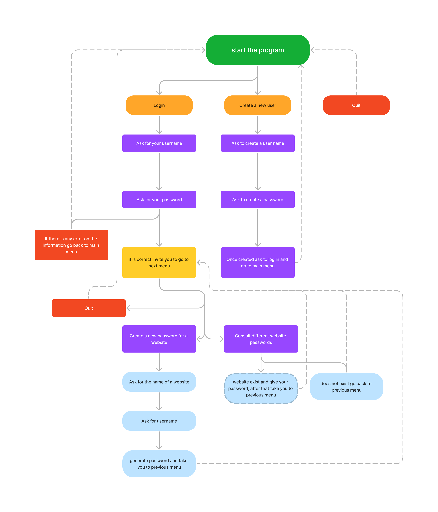

# PassGenius

[View live project](https://passgenius.herokuapp.com/)

 

[View on Gitpod](https://github.com/solracnauj92/PassGenius.git)

As you contemplate the intricacies of this password management program, imagine the vast network of interconnected websites, each requiring its own unique password for access. 
With so many passwords to remember, it can be overwhelming to keep track of them all. 
This program offers a solution, providing users with the ability to securely store their passwords in a centralized location.

 
As you consider the options presented by the program, take a moment to reflect on the power of technology to simplify our lives. With just a few clicks, users can generate a new, randomly generated password for a website, ensuring that their online accounts remain secure. And with the ability to retrieve saved passwords for previously added websites, users can rest assured that they will never be locked out of their accounts due to forgotten login information.

 
But as you delve deeper into the inner workings of the program, consider the potential risks of storing sensitive information in the cloud. While the use of a service account and the google-auth library offer a layer of security, it is important to remain vigilant and take steps to protect your personal data.

 
In a world where technology is rapidly advancing, it is up to each individual to take responsibility for their online security. By utilizing tools such as this password management program, we can stay one step ahead of cyber threats and safeguard our digital identities. So login, create a new user, and start creating your passwords – the power is in your hands!

   

 

---

## CONTENTS  
  
  * [User Experience](#user-experience-ux)
    * [Goal](#goal) 
    * [First Time Visitor](#first-time-visitor) 
    * [Returning Visitor](#returning-visitor) 
    * [Frequent Visitor](#frequent-visitor) 
  * [Desktop, Tablet & Mobile Testings](#desktop-desktop--mobile-testing)
  * [Future Features](#future-features)
  * [Technologies Used](#technologies-used)
  * [Deployment](#deployment)
  * [How to deploy](#how-to-deploy)
  * [Audits](#validation)
    * [Performance Report](#lighthouse)
    * [Python Validation](#python-validation) 
    * [Bugs & fixes](#bugs-fixes)
    * [Unsolved bugs](#unsolved-bugs) 
  * [Credits](#credits) 
    * [References](#references) 
    * [Acknowledgements](#acknowledgements)

    --- 

## User Experience (UX)  

### **Goal**  
The goal of the program PassGenius is to provide a password management system that allows users to generate, store, and retrieve passwords for different websites. The program uses the Google Sheets API to store and retrieve passwords. The program provides a command-line interface that allows users to log in, generate passwords, retrieve passwords, and quit the program easily.  

 

This diagram explains how the program works.

 
 
### **First Time Visitor**

- The first time the user tries the application, they will realize how versatile and comfortable it is to use PassGenius. Once registered, they will be able to use the system without any prior knowledge required.

 

### **Returning Visitor**

- Soon the user will be constantly revising their old passwords and creating new ones. Who hasn't thought of writing down a password on a piece of paper and never finding it again! And what to say about those applications that over time you forget about them, they take up space and are complex with this application you will only have to save a shortcut on your desktop and you will be able to access it quickly 

 

### **Frequent Visitor**  

- This application is also designed for those businessmen who have to manage a large number of employees, with a couple of answers you will be able to manage each user effectively 

 

--- 

## Desktop, Tablet & Mobile Responsiveness 
My website is designed to be responsive and accessible on any device, mainly thanks to its scrolling functionality. I have tested them across all devices (Iphone, Ipads, Samsung tablets, Ipad mini, Desktop) using google dev tools.

--- 

## Future Features  
 
 1. Password strength checker: You could add a function that checks the strength of a generated password and ensures it meets certain criteria, such as length, complexity, and uniqueness.

 2. Two-factor authentication: You could add support for two-factor authentication (2FA), which would require users to provide a second form of identification in addition to their password when logging in.

 3. Password expiration: You could add a feature that forces users to change their passwords after a certain period of time to improve security.

 4. Password history: You could add a feature that prevents users from reusing passwords they have used in the past, which would improve security by ensuring that users regularly change their passwords.

 5. User roles and permissions: You could add support for user roles and permissions, which would allow you to control what users can do within the system based on their level of access.

 6. Password sharing: You could add a feature that allows users to securely share passwords with other users, which could be useful for teams or organizations.

 7. Multi-language support: You could consider adding support for multiple languages to make your code more accessible to a wider range of users.

---   
  
## Technologies Used    

- HTML/CSS Javascript
    - Has been included within the template of code insitute 
- Python
    - Python was mainly used to generate prompts and answers and connect it to the database
 Heroku
    - Heroku was used to deploy the project and to execute it
- [Figma](https://www.figma.com)
    - The user journey was designed via Figma
- [QuillBot](https://quillbot.com/)
    - QuillBot was used scan writings and alert any errors in grammar, spelling, punctuation as well as rephrase any research used for the website
- [GitHub](https://github.com/sharonfranciscofaria)
    - Github stores, manages, and track changes to the project code
- [Chrome DevTools](https://developer.chrome.com/docs/devtools/)
    - Chrome DevTools helped to debug, inspect, test the website's responsive design and check performance analysis tools
- [Am I responsive](https://ui.dev/amiresponsive)
    - Mock up and check responsiveness across different devices 
- [Patorjk](https://patorjk.com/)
    - Patorjk was used to create the ASCII artwork

---   
## Deployment

### **How to deploy**  

GitHub and Heroku were used to deploy the website. These were the steps taken to achieve this: 

GitHub

1. Login to GitHub account
2. Navigate to the project repository
3. Click the Settings button near the top of the page
4. In the left-hand menu, find and click on the Pages button
5. In the Source section, choose 'main' from the drop-down, select branch menu
6. Select 'root' from the drop-down folder menu
7. Click 'Save' and after a few moments the project will have been made live and a link is visible at the top of the page

Heroku

 1. Create a new app on Heroku by navigating to the Heroku Dashboard and clicking the "New" button in the top right corner. Give the app a name and select a region.
 2. Connect the app to your GitHub repository by clicking on the "Deploy" tab in the Heroku Dashboard and selecting "GitHub" as the Deployment method. Then click the "Connect to GitHub" button and authenticate with your GitHub account.
 3. Select the GitHub repository you want to deploy from the dropdown menu and click the "Connect" button.
 4. Choose the branch you want to deploy and click the "Enable Automatic Deploys" button to automatically deploy changes from that branch whenever they are pushed to GitHub.
 5. Optionally, you can configure additional settings such as environment variables, add-ons, and buildpacks in the "Settings" and "Resources" tabs.
 6. Once everything is set up, click the "Deploy Branch" button to deploy your app to Heroku.
 7. Wait for the deployment to complete, and your app will be live on the internet!

---  
    
## Audits 

### **Lighthouse report** 
Desktop

Mobile
 

### **Python Validation using CI Python Linter** 

   
### **Bugs & Fixes**  
 1. In heroku, orginally I did not add the requirement needed, I struggled to deploy the project. In the end it went through after finding out. 

 2. Other users could see the passwords in the project, so I created an ID user to identify every password for every user.

 3. I tried to modify the styling sheet, but it caused me so many errors, until I found the tamplate html layout and added some changes. 

### **Unsolved Bugs** 
 
1. In some cases when the user uses the mobile version, the input keyboard doesn't respond properly.

---  

## Credits  
  
### **References**

- [Code Institute](https://codeinstitute.net/ie/) 
- [W3Schools](https://www.w3schools.com/) 
- [StackOverflow](https://stackoverflow.com/)
- [Python Programming with Sanju](https://www.youtube.com/watch?v=dEi_MCfhw5o)
- [Tech Raj](https://www.youtube.com/watch?v=KQjf9get6PE)
- [Programming with Mosh](https://www.youtube.com/watch?v=4WMsIele2lI)

### **Acknowledgements** 

 1. To my beloved Churro (Sharon Francisco Faria)
 2. Code Institute 
 3. My current workpakce, the NHS
 4. My mentor, Can 
  